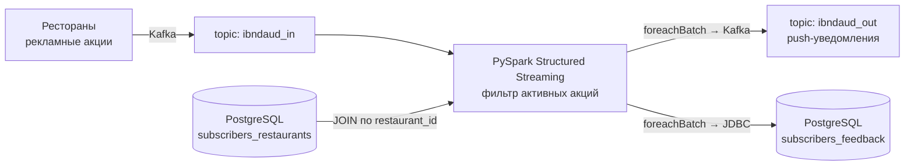

# Restaurant Subscribe Streaming Service


## Описание проекта

В рамках проекта реализован сервис потоковой обработки данных для агрегатора доставки еды.  
Сервис обрабатывает рекламные кампании ресторанов с ограниченным сроком действия и отправляет уведомления только тем пользователям, которые добавили ресторан в избранное.

Приложение построено с использованием **Apache Spark Structured Streaming**, **Kafka** и **PostgreSQL**.

---

## Бизнес-логика

1. Ресторан отправляет информацию о временной акции в Kafka.
2. Сервис:
   - читает поток сообщений из Kafka;
   - проверяет, активна ли акция (по времени старта и окончания);
   - получает список подписчиков ресторана из PostgreSQL;
   - объединяет потоковые и статичные данные по `restaurant_id`;
3. Для каждого подписчика формируется:
   - сообщение для сервиса push-уведомлений (Kafka);
   - запись в таблицу для последующего анализа фидбэка (PostgreSQL).


Таким образом, уведомления получают только те пользователи, у которых ресторан находится в избранном.

---

## Технологии

- Python
- PySpark (Structured Streaming)
- Apache Kafka
- PostgreSQL
- Docker

---

## Особенности реализации

- Потоковая обработка в режиме near real-time
- JOIN потоковых и статичных данных
- Два независимых стока данных (Kafka + PostgreSQL)
- Использование `foreachBatch` для записи в несколько систем
- Персистентность датафрейма для оптимизации обработки
- Фильтрация только активных рекламных кампаний

---
## Структура проекта

```text
.
├── restaurant_subscribe_streaming_service.py  # стриминг-сервис (PySpark)
├── create_subscribers_feedback.py             # создание таблицы фидбэка
├── README.md
└── LICENSE.txt
```
---
## Как запустить

> Инфраструктура курса: управляемые Kafka и PostgreSQL в Yandex Cloud.

```bash
# 1. Создать таблицу для фидбэка
python create_subscribers_feedback.py

# 2. Запустить стриминг-сервис
spark-submit restaurant_subscribe_streaming_service.py

# либо просто (PySpark сам скачает пакеты, они указаны в spark.jars.packages):
python restaurant_subscribe_streaming_service.py
```
---

## Результат

Сервис позволяет:

- оперативно доставлять уведомления о временных акциях;
- сузить аудиторию до подписчиков конкретного ресторана;
- сохранять данные для дальнейшего анализа пользовательского фидбэка.

Проект демонстрирует практическое применение потоковой обработки данных в задачах персонализированных уведомлений и real-time аналитики.

---
## Лицензия

Проект распространяется по лицензии [MIT](LICENSE.txt).
